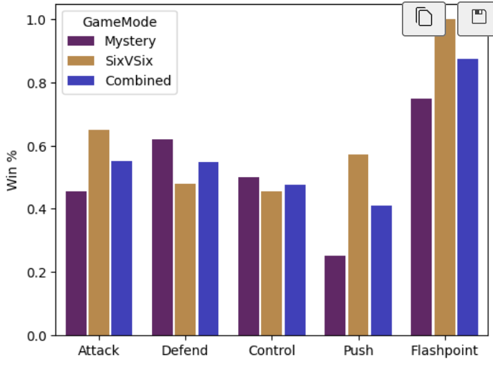

# Statistical analysis of Overwatch performance and map/mode randomness

Requirements:
- pandas
- numpy
- matplotlib
- seaborn

Analysis of Overwatch matches (arcade only) to answer the question of whether my wife and I are put on Defence statistically more often than Attack. 

Game statistics are recorded by hand in [OWstats.csv](OWstats.csv) (With progressively more detailed stats recorded over time). 

All analysis and plots are handled in the accompanying [notebook](OWStatPlots.ipynb)

